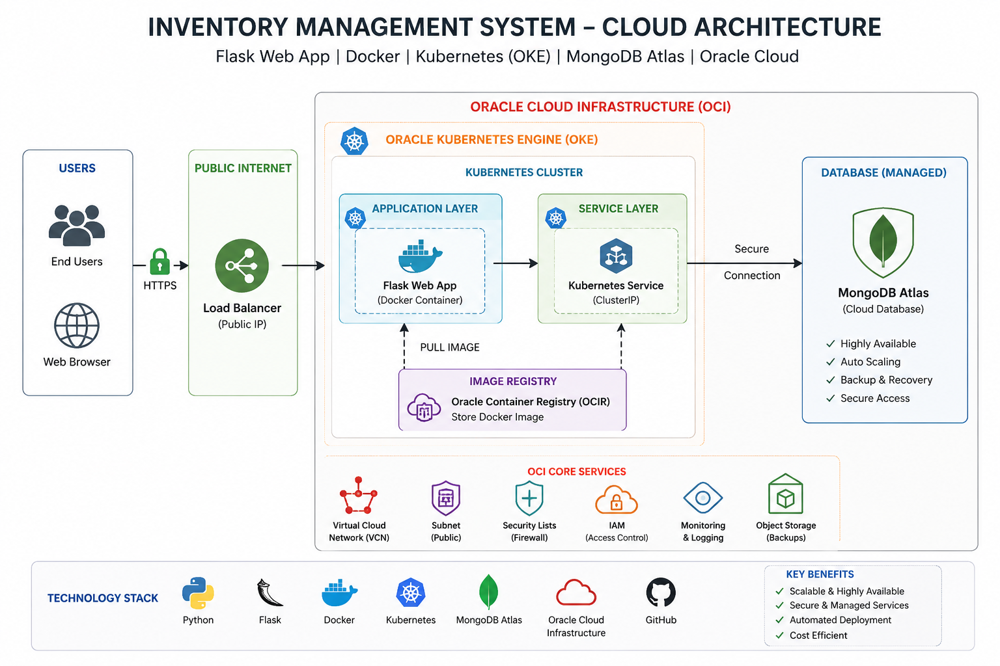

# 📦 Inventory Management System (Cloud Project)

A full-stack **inventory web application** built with **Flask, MongoDB, Docker, and Kubernetes (OKE Cloud)**.  
This project is part of a cloud computing and DevOps course.

---

# 🚀 Features

- 📊 Dashboard with products statistics
- 🔍 Search products by name
- 🎯 Filter by category
- ➕ Add products (CRUD)
- 🗄️ MongoDB database integration
- 🐳 Docker containerized application
- ☸️ Kubernetes deployment on Oracle Cloud (OKE)
- 🌐 Public access via LoadBalancer

---

# 🏗️ Architecture

Browser → Flask Web App → MongoDB → Kubernetes Service → LoadBalancer → Internet

In cloud deployment:

- Flask runs inside Kubernetes Pods
- MongoDB runs either:
  - inside cluster (mongo.yaml)
  - OR MongoDB Atlas (recommended)
- Service exposes application via LoadBalancer

---

# 📂 Project Structure

projet-cloud-web/
│
├── app/
│   ├── app.py
│   ├── templates/
│   │   └── index.html
│   └── requirements.txt
│
├── k8s/
│   ├── web.yaml
│   ├── mongo.yaml
│
├── Dockerfile
├── docker-compose.yml
└── README.md

---

# ⚙️ Technologies Used

- Python 3
- Flask
- MongoDB
- PyMongo
- Docker
- Kubernetes (OKE - Oracle Cloud)
- OCIR (Oracle Container Registry)

---

# 🔧 Environment Variables

## Local / Kubernetes (MongoDB container)
MONGO_URI=mongodb://mongo:27017/

## Cloud Atlas version
MONGO_URI=mongodb+srv://<username>:<password>@cluster0.mongodb.net/catalogue

---

# 🐳 Run Locally (Docker)

docker build -t catalogue-web:1.0 .
docker run -p 5000:5000 -e MONGO_URI=mongodb://mongo:27017/ catalogue-web:1.0

---

# ☸️ Kubernetes Deployment (Oracle OKE)

## 1. Push image to OCIR

docker tag catalogue-web:1.0 ca-toronto-1.ocir.io/<namespace>/catalogue-web:1.0
docker push ca-toronto-1.ocir.io/<namespace>/catalogue-web:1.0

---

## 2. Apply manifests

kubectl apply -f k8s/mongo.yaml
kubectl apply -f k8s/web.yaml

---

## 3. Check status

kubectl get pods
kubectl get svc

---

## 4. Get public URL

Look for:

EXTERNAL-IP (LoadBalancer)

http://40.233.123.166/

---

# ☁️ MongoDB Atlas (DBaaS)

Instead of running MongoDB in Kubernetes:

- Create cluster on MongoDB Atlas
- Create database user
- Whitelist IP (0.0.0.0/0 for testing)
- Copy connection string

Then replace only:

MONGO_URI=mongodb+srv://<user>:<password>@cluster0.mongodb.net/catalogue

---

# 🧠 Learning Objectives

- Docker containerization
- Kubernetes orchestration
- Cloud deployment (OKE Oracle)
- Managed database (MongoDB Atlas)
- Microservices architecture

---

# ⚠️ Common Issues

## ❌ MongoDB auth error
- wrong username/password
- user not created in Atlas
- wrong cluster URL

## ❌ Image pull error
- missing OCIR secret
- wrong image path

## ❌ Pod restart loop
- wrong MONGO_URI
- MongoDB not reachable

---

# 👨‍💻 Authors

- Larbi Teraoui
- Omar Aoun

---

# 📜 License

Educational project – Cloud & DevOps training

# 🔗 GitHub Repository

https://github.com/arbi2020/inventory-cloud-project